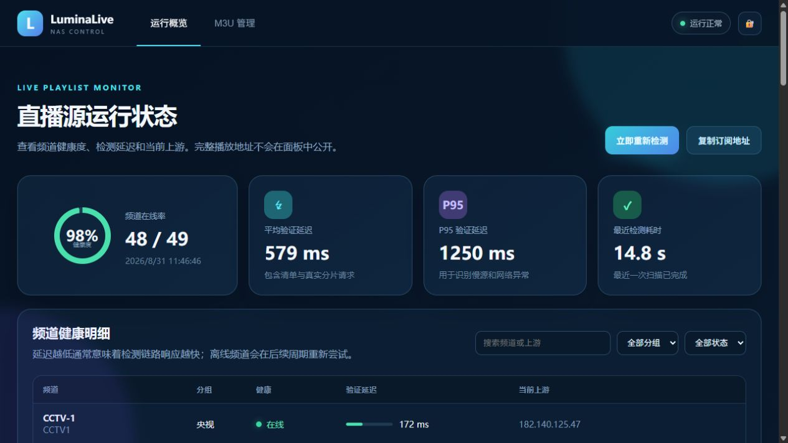
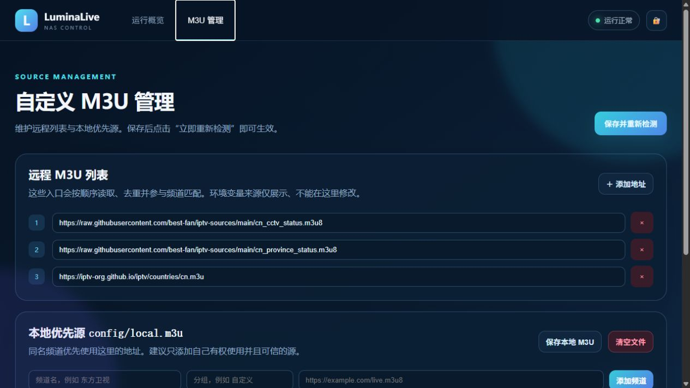

# LuminaLive NAS

面向家庭 NAS 的自托管直播源整理器。它定时读取公开或自定义 M3U，检查 HLS 清单和真实视频分片，只发布当前可播放的频道，并保留最近一次成功结果。

## 特点

- 一个订阅同时包含央视和卫视，不需要切换多个 M3U。
- 播放器直接连接已验证源，视频流量不绕 NAS，降低换台延迟和 NAS 带宽压力。
- 每 30 分钟重新检测；本轮失败时保留上一份可用列表。
- 支持 `linux/amd64` 与 `linux/arm64`，适用于极空间、群晖、威联通、飞牛、绿联、铁威马、Unraid、TrueNAS SCALE、CasaOS/OpenMediaVault 和普通 Linux。
- 支持额外远程 M3U，以及 NAS 本地的 `config/local.m3u`。
- 容器只需要 `/config`、`/data` 两个卷和一个 TCP 端口。

> “兼容所有 NAS”指支持标准 Docker/Compose 且 CPU 为 amd64 或 arm64 的机型。不能运行 Docker 的老机型、32 位 ARM、厂商关闭容器功能的型号不在支持范围内。

## 快速部署

```bash
git clone https://github.com/TomShen-simple/LuminaLive-NAS.git
cd LuminaLive-NAS
cp .env.example .env
mkdir -p config data
docker compose up -d
docker compose logs -f
```

首次启动会测速，通常等待 1～5 分钟。健康检查通过后访问：

```text
http://NAS局域网IP:18780/live/yangshi.m3u
```

状态接口：

```text
http://NAS局域网IP:18780/status.json
http://NAS局域网IP:18780/healthz
```

浏览器直接打开 `http://NAS局域网IP:18780/` 可进入 Web 管理后台，查看频道健康度、验证延迟和上游状态，并维护远程/本地 M3U、手动触发重新检测。

管理写操作默认仅允许局域网客户端。需要通过反向代理访问管理功能时，建议在 `.env` 设置：

```dotenv
ADMIN_TOKEN=请换成足够长的随机字符串
```

### Web 管理后台





后台支持频道/分组/在线状态筛选，显示平均与 P95 验证延迟；M3U 管理页可以增删远程列表、可视化维护 `local.m3u`、直接编辑原始内容并提交立即检测。

详细说明：

- [通用 Docker Compose 部署教程](docs/compose.md)
- [极空间 Docker Compose 部署教程](docs/zspace.md)
- [NAS 兼容性与差异](docs/platforms.md)
- [故障排查](docs/troubleshooting.md)

## 自定义频道

首次运行会在 `config/channels.json` 写入默认频道配置。可以调整频道、别名和公开源列表。

若已有自己的 M3U，把它保存为：

```text
config/local.m3u
```

本地清单优先于远程清单。若其中使用 `192.168.x.x` 等局域网上游，需要在 `.env` 中设置：

```dotenv
ALLOW_PRIVATE_UPSTREAMS=true
```

额外远程清单可以配置为：

```dotenv
EXTRA_M3U_URLS=https://example.com/a.m3u,https://example.com/b.m3u
```

## 更新与卸载

```bash
docker compose pull
docker compose up -d
```

停止但保留配置和数据：

```bash
docker compose down
```

程序不会自动删除宿主机的 `config`、`data` 目录。确认不再需要后再手工删除。

## 安全与合规

- 默认仅应在家庭局域网使用；不要把端口直接暴露到公网。
- 项目不提供、托管或销售媒体内容，也不破解 DRM、会员或地区限制。
- 默认源只是索引入口，频道可用性和授权因地区、网络、时间而变化。
- 用户必须确保对自定义清单及其内容拥有合法使用权。
- `/status.json` 只显示上游主机名和测速结果，不公开带签名参数的完整源地址。

## 开发

```bash
python -m venv .venv
. .venv/bin/activate
pip install -r requirements.txt
python -m unittest discover -s tests -v
docker compose -f compose.yaml -f compose.build.yaml up -d --build
```

MIT License
